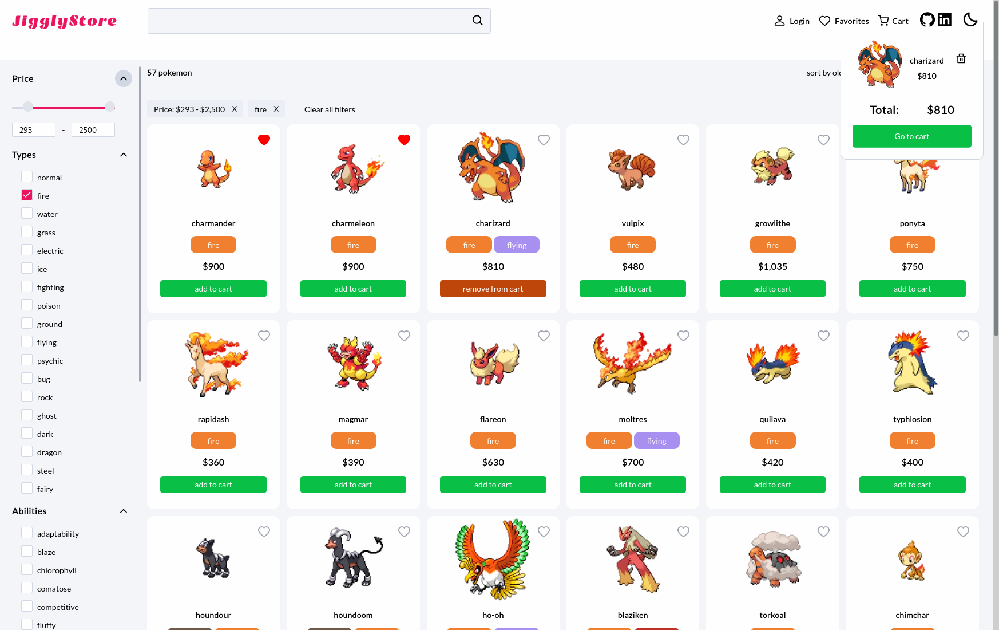

### Hello, I'm Elmer :wave:
I am a frontend developer

#### Technologies

#### Features
* Dark mode
* Favorite pokemon, together with a modal to view them
* Multiple filters
* Different sorting methods
* Cart dropdown

##### The data was gotten from this api [pokeapi](https://pokeapi.co/)

#### Checkout my last project here [Jigglystore](https://github.com/premell/pokemon_store_nextjs)

