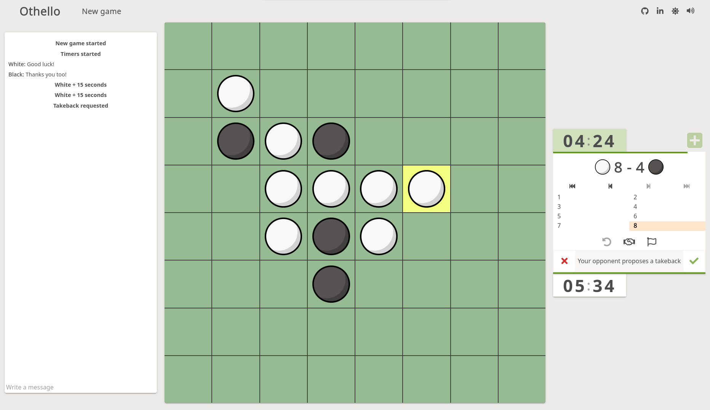

## Hello, World! :wave: I'm Elmer.
A passionate frontend developer with a knack for learning new technologies and bringing interactive web designs to life. Over the years, I've honed my skills in a variety of languages and tools and have developed an affinity for creating sleek, intuitive user interfaces. When I'm not coding, you can find me exploring the latest tech trends and contributing to the open-source community.

### Languages and Tools :hammer_and_wrench:

### Checkout my latest project, a multiplayer othello game!

### Get in Touch
Email: elmer.lingestal@live.se
linkeldn: [Elmer Lingestål](https://www.linkedin.com/in/elmer-lingest%C3%A5l-3571021a8/)
